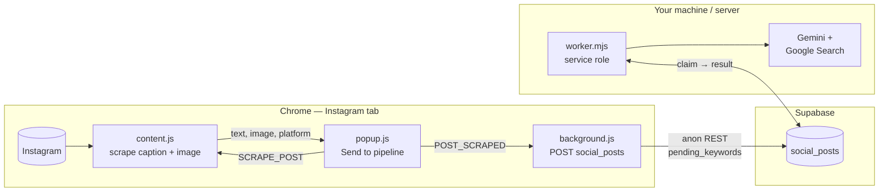
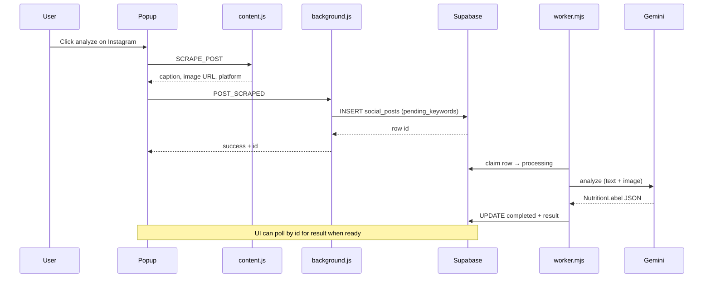

# laila-coders

A Chrome extension **“Nutrition Label”** for social media: it scrapes a post, sends it through **Supabase**, and a **worker** runs **Gemini** (with Google Search grounding) to assess credibility, factual alignment, and visual integrity.

AI track (Path C) lives in [`ai-track/`](ai-track/) — **[documentation index](ai-track/docs/README.md)** (phases, Supabase bridge, Irfan contract). Phase 2 CLI, Phase 3 HTTP server or Supabase worker, `schemas/`.

---

## Extension pipeline

More detail: [`ai-track/docs/supabase/SUPABASE_BRIDGE.md`](ai-track/docs/supabase/SUPABASE_BRIDGE.md).
