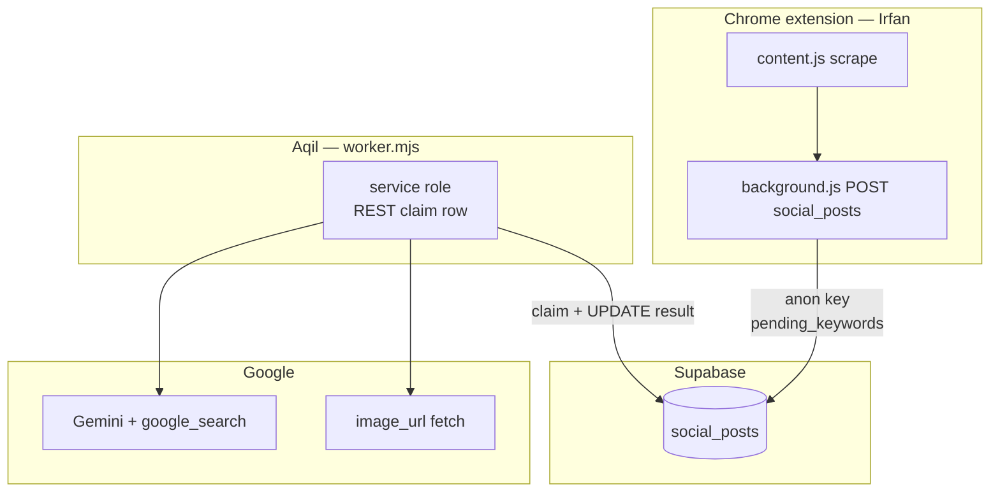
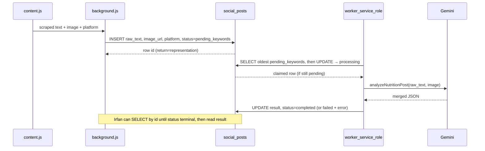

# Supabase bridge — **`social_posts`** (Irfan + Aqil)

The extension **`background.js`** POSTs to **`/rest/v1/social_posts`** with the shape below. The **worker** claims rows where **`status = 'pending_keywords'`**, runs Gemini, then updates **`result`** (Nutrition Label JSON) or **`error`**.

## Architecture graph



## Sequence



## Table columns (contract)

| Column | Writer | Notes |
|--------|--------|-------|
| `id` | DB | UUID. Returned to extension after insert — **poll** `SELECT` by `id`. |
| `raw_text` | Irfan | Caption string from scrape. |
| `image_url` | Irfan | Single HTTPS URL or null. |
| `platform` | Irfan | e.g. `instagram`. |
| `status` | Irfan → Worker | Irfan sets **`pending_keywords`**. Worker: **`processing`** → **`completed`** / **`failed`**. |
| `result` | Worker | `NutritionLabelAnalysis` jsonb when completed. |
| `error` | Worker | Text when failed. |
| `from_cache` | Worker | `true` if `result` was copied from **`post_analysis_cache`** (same `post_hash`, no Gemini call). See [phases/PHASE4_CACHE.md](../phases/PHASE4_CACHE.md). |

SQL: [`supabase/migrations/20260329150000_social_posts.sql`](../../supabase/migrations/20260329150000_social_posts.sql) + cache migration [`20260330120000_post_analysis_cache.sql`](../../supabase/migrations/20260330120000_post_analysis_cache.sql).

## Worker

```bash
cd ai-track/supabase
cp .env.example .env
npm install
node --env-file=.env worker.mjs
```

## Security

- Extension: **anon** key only (never service role / never `GEMINI_API_KEY`).
- RLS in migration is **dev-loose**; tighten before production.

## Alternate: `nutricheck_jobs`

Earlier experiment with `post_text` + `image_urls[]` — see [`20260329120000_nutricheck_jobs.sql`](../../supabase/migrations/20260329120000_nutricheck_jobs.sql). **Not** what `background.js` uses today.

## HTTP `/analyze` (local dev)

[`server/`](../../server/) — direct POST without Supabase.

- [Documentation index](../README.md)
